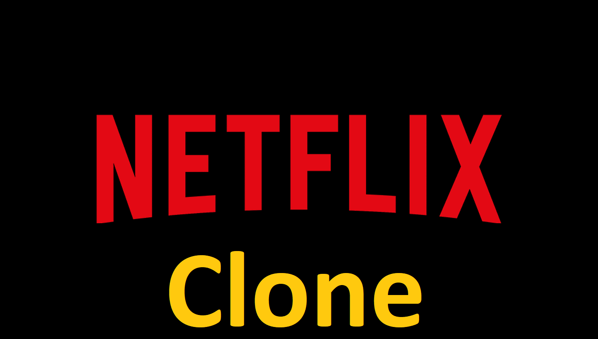
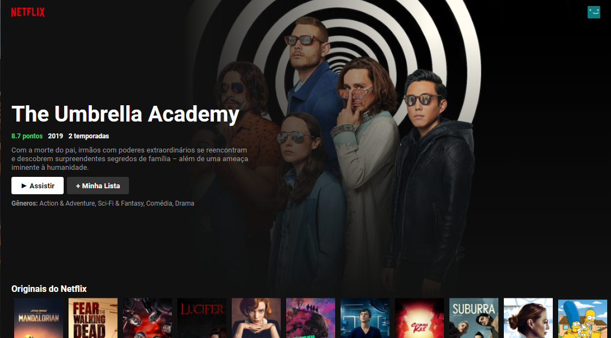
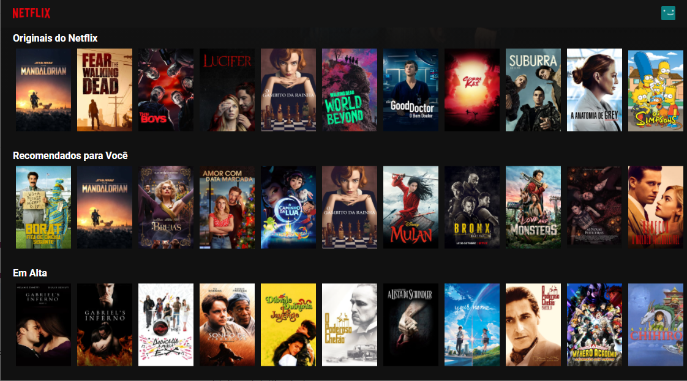
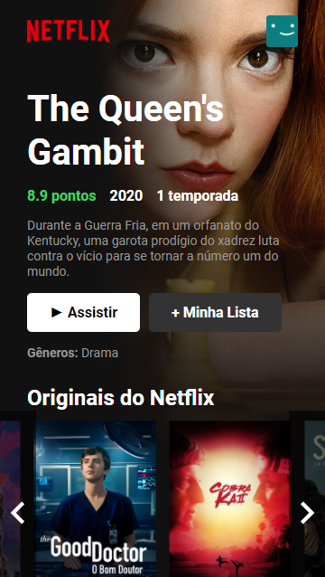
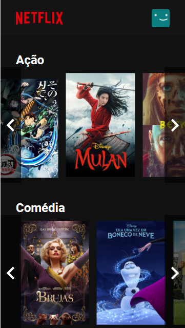
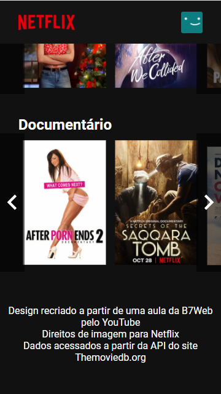

<h1 align="center">
    
    <br>Exercício da aula ministrada por Bonieky Lacerda da b7web<br/>
    HTML | ReactJS | CSS
</h1>

<p align="center">
  
  
     
</p>

<p align="center">
  <br>
  <br>
  
  
   
<p>

## :bookmark: Sobre

O **Netflix Clone** é uma aplicação Web desenvolvida com o objetivo de recriar a página inicial do site Netflix para demonstrar a utilização da biblioteca ReactJS em conjunto com os mecanismos do CSS na construção do front-end de uma aplicação. Para conseguir recriar esta aplicação a partir de um clone do repositório será necessário realizar um cadastro no site **[The movie db](https://www.themoviedb.org/)** e depois seguir para a seção de **[API](https://www.themoviedb.org/settings/api/)** para gerar a chave da API e, assim, conseguir utilizar a API do site e capturar as informações dos filmes e séries que serão necessárias para construção do design da página clone. 
  
## :rocket: Tecnologias

-  [Node.js](https://nodejs.org/en/)
-  [ReactJS](https://reactjs.org/)

## :boom: Como Executar

- ### **Pré-requisitos**

  - É **necessário** possuir o **[Node.js](https://nodejs.org/en/)** instalado no computador
  - É **necessário** possuir o **[Git](https://git-scm.com/)** instalado e configurado no computador
  - Também, é **preciso** ter um gerenciador de pacotes seja o **[NPM](https://www.npmjs.com/)** ou **[Yarn](https://yarnpkg.com/)**.
  
1. Faça um clone do repositório:

```sh
  $ git clone https://github.com/diegoalmda/clonenetflix
  # No projeto foi criado um arquivo Api-key.js contendo uma constante com a API_KEY que deve ser importada no arquivo Tmdb.js
```

2. Executando a Aplicação:

```sh
  # Instalando as dependências do projeto.
  $ npm install 
  # Inicie a API
  $ npm start 
  # Para abrir no browser acesse o endereço localhost na porta 3000
  Abra [http://localhost:3000](http://localhost:3000) para visualizar a aplicação no browser.
```


## :memo: Licença

Esse projeto está sob a licença MIT. Veja o arquivo [LICENSE](LICENSE.md) para mais detalhes.

---
<sup>Projeto desenvolvido com a tutoria de [Bonieky Lacerda]() da [b7web](https://b7web.com.br/).</sup>
